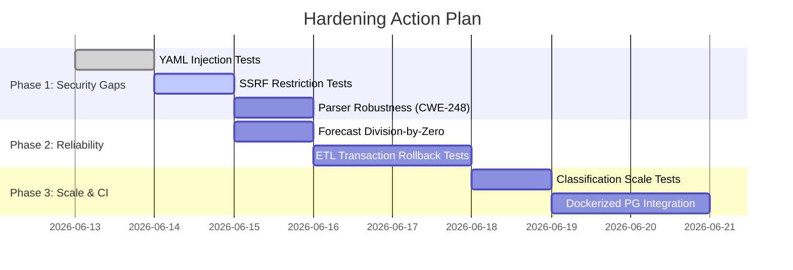

# Test Strategy & Coverage Review

This document evaluates the testing strategy, test coverage, and test quality for the **BurnRate** codebase, with a specific focus on gaps identified in the security and performance analysis of prior phases.

---

## 1. Executive Summary

The BurnRate test suite is built on **Vitest** and achieves a solid overall statement coverage of **83.42%**. The test structure leans heavily on unit tests running against an in-memory SQLite database (`:memory:`), utilizing mocks for the GitHub API. 

While the test suite successfully verifies standard "happy-path" behaviors, it suffers from several critical testing gaps:
1. **Zero PostgreSQL Verification**: Despite having a dual-DB schema setup (PostgreSQL and SQLite), the entire PostgreSQL code path (connection pooling, migrations, schemas, and queries) is completely untested.
2. **Security Vulnerability Gaps**: There are no tests verifying defenses against YAML injection/hijacking, SSRF via signed URL downloading, or input validation bounds.
3. **Robustness & Edge-Case Gaps**: No tests evaluate parser resilience against malformed numeric inputs (e.g. floats causing BigInt SyntaxErrors), division-by-zero scenarios in forecasting, or transaction rollbacks on pipeline failures.
4. **Performance & Scale Gaps**: There are no performance scale tests or load assertions verifying database write batching or the $O(N^2)$ complexity of the classification engine.

---

## 2. Test Coverage Analysis

### Code Paths Covered by Current Tests
* **`src/config.ts`**: Verifies that standard configuration loads and expands environment variables, and that it throws when env vars are missing.
* **`src/db/client.ts`**: Verifies SQLite client initialization.
* **`src/db/migrate.ts`**: Checks that SQLite schema migrations run without errors and create the `raw_reports` table.
* **`src/db/schema.ts`**: Confirms schema object exports are defined.
* **`src/etl/parse_*.ts`**: Happy path parsing verification for enterprise reports, daily usage reports, team usage, team members, and seats.
* **`src/etl/pipeline.ts`**: Orchestration run with fully mocked GitHub client API and SQLite database.
* **`src/etl/raw_storage.ts`**: Basic payload metadata mapping.
* **`src/forecast/engine.ts`**: A single happy path calculation test.
* **`src/github/client.ts`**: Successful/unsuccessful fetch call simulation.
* **`src/github/reports.ts` & `seats.ts`**: Basic mock paginations.
* **`src/index.ts`**: Command router argument resolution.

### Critical Untested Paths
* **PostgreSQL Database Client & Migrations**: Lines 14-15 and 31-33 in `src/db/client.ts` (PostgreSQL client pool setup) and PostgreSQL migration commands in `src/db/migrate.ts` are 100% uncovered.
* **PostgreSQL Schemas & Queries**: PostgreSQL tables/columns and the PostgreSQL-specific aggregates/intervals in `src/classify/runner.ts` (lines 44-47: `credits::numeric`, `INTERVAL '30 days'`) are never executed during testing.
* **Pipeline Transaction Rollback**: No test verifies that the pipeline fails atomically if database inserts fail.
* **SSRF Target Validation**: No tests verify hostname rejection on signed URL fetching.
* **YAML Injection Validation**: No tests verify rejection of raw injection strings in the parser.
* **Parser Exception Tolerances**: No tests pass float values, non-numeric strings, or missing values to the ETL parsers to check for crash behavior.
* **Forecasting Division-by-Zero**: No tests check what happens when `poolTotal` is `0` or negative.

---

## 3. Test Quality & Pyramid Adherence

### Test Pyramid Adherence
* **Unit Tests (~85%)**: High concentration of isolated unit tests (parsers, utility functions, configuration loader).
* **Integration Tests (~15%)**: Pipeline runners, CLI entrypoint routing, and classification database queries executing against an in-memory SQLite database.
* **E2E / System Tests (0%)**: No tests run the compiled application end-to-end, execute actual system subprocesses, or test against a live PostgreSQL database container.

### Mock Quality and Test Isolation
* **Mocks**: Mocks are created manually using `vi.fn().mockResolvedValue(...)` or `vi.stubGlobal('fetch', ...)`. While simple, they fail to simulate realistic edge cases like network timeouts, API rate-limiting headers (e.g. 429 Retry-After), or corrupted JSON responses.
* **Test Isolation**: Excellent for SQLite tests because they use `:memory:` clients that are re-created. However, mock cleanups in `tests/index.test.ts` are done manually per test using `spy.mockRestore()`. If an assertion fails early, mock restorers may be skipped, causing test pollution. All mock restorations should be handled globally in `afterEach`.

---

## 4. Security Test Gaps

### Finding 1: YAML Structure Hijacking / Injection (CWE-94)
* **Severity**: High
* **Risk**: Env var replacement is done on the raw YAML string before parsing. If an environment variable contains newlines, colons, or indentation, it can inject arbitrary keys or modify the YAML tree structure, bypassing configuration safeguards.
* **Untested Path**: Raw environment variable strings containing colons, newlines, or special characters.
* **Recommendation**: Add tests verifying that environment variables containing newlines or colons do not alter the parsed configuration structure.
* **Example Test Code**:
```typescript
it('rejects environment variables attempting YAML injection', () => {
  const dir = mkdtempSync(join(tmpdir(), 'burnrate-'));
  const file = join(dir, 'burnrate.yml');
  
  // Malicious environment variable containing structure modifications
  process.env.GITHUB_TOKEN = 'token\n  org: injected-org\n  enterprise: injected-ent';
  process.env.DATABASE_URL = 'postgresql://localhost:5432/test';

  try {
    writeFileSync(
      file,
      `github:\n  enterprise: acme\n  org: acme-inc\n  token: \${GITHUB_TOKEN}\npostgres:\n  url: \${DATABASE_URL}\n`,
      'utf8',
    );
    
    // The loader should either escape env vars or parse first, then replace.
    // If vulnerable, the config will have been hijacked.
    const config = loadConfig(file);
    
    // Assert that the structure was NOT hijacked
    assert.equal(config.github.org, 'acme-inc');
    assert.equal(config.github.enterprise, 'acme');
  } finally {
    delete process.env.GITHUB_TOKEN;
    delete process.env.DATABASE_URL;
  }
});
```

### Finding 2: Server-Side Request Forgery (SSRF) in Signed URL Downloader (CWE-918)
* **Severity**: Critical
* **Risk**: The `fetchSignedUrl` method fetches any URL string directly without checking the domain, IP, or port. A compromise of report metadata could allow an attacker to make the server perform GET requests to local metadata endpoints (e.g., AWS IMDS `169.254.169.254`) or local internal services.
* **Untested Path**: `src/github/client.ts` -> `fetchSignedUrl` validation logic.
* **Recommendation**: Implement and write tests for host validation in `fetchSignedUrl` that restrict calls to expected GitHub hosts (e.g., `*.github.com`, `*.githubusercontent.com`).
* **Example Test Code**:
```typescript
it('throws an error and rejects SSRF attempts to unauthorized hosts', async () => {
  const client = createGitHubClient('token', 'acme', 'acme-inc');
  
  // Malicious URL pointing to local metadata or local network
  const maliciousUrls = [
    'http://169.254.169.254/latest/meta-data',
    'http://localhost:5432/status',
    'https://malicious-attacker.com/payload'
  ];

  for (const url of maliciousUrls) {
    await assert.rejects(
      () => client.fetchSignedUrl(url),
      /SSRF Prevention: Unauthorized host/
    );
  }
});
```

### Finding 3: Uncaught Parser Exceptions Leading to Denial of Service (CWE-248 / CWE-755)
* **Severity**: High
* **Risk**: In `src/etl/parse_enterprise.ts`, `BigInt()` is used to cast tokens. If an API payload contains a float value (e.g. `10.5` or `"10.5"`) or a non-numeric string (e.g. `"N/A"`), `BigInt` will throw a fatal `SyntaxError` which crashes the Node pipeline process.
* **Untested Path**: Floating point numbers or non-numeric strings in the `tokens_input` and `tokens_output` fields.
* **Recommendation**: Add parser robustness tests that supply invalid inputs and assert that the parser falls back safely without throwing uncaught exceptions.
* **Example Test Code**:
```typescript
it('handles malformed numeric and token data safely without crashing', () => {
  const malformedReport = {
    report_day: '2026-06-12',
    data: [{
      github_login: 'jdoe',
      credits_used: 'invalid-float-150.5abc',
      tokens_input: '10.5', // Float strings crash BigInt()
      tokens_output: 'abc', // Non-numeric strings crash BigInt()
      chat_requests: 'invalid-int',
    }]
  };
  
  // Parse daily usage should catch internal casting errors and default to 0n / 0
  const rows = parseDailyUsage(malformedReport as any);
  assert.equal(rows.length, 1);
  assert.equal(rows[0].tokensInput, 0n);
  assert.equal(rows[0].tokensOutput, 0n);
  assert.equal(rows[0].chatRequests, 0);
  assert.equal(rows[0].credits, '0');
});
```

---

## 5. Performance Test Gaps

### Finding 1: $O(N^2)$ Complexity in Classification Engine
* **Severity**: High
* **Risk**: The classification engine computes user consumption percentiles by running `computePercentile`, which internally runs `.filter` over the entire array for every single user. This results in $O(N^2)$ time complexity. For a large enterprise with 50,000 active Copilot users, this would block the single-threaded Node event loop for several minutes.
* **Untested Path**: Scale performance testing of `classifyUsers`.
* **Recommendation**: Implement a performance scale test with 10,000+ mock users to verify execution time remains within reasonable bounds (< 100ms).
* **Example Test Code**:
```typescript
it('executes classification efficiently under high scale (10,000 users)', () => {
  const userCount = 10000;
  const userCredits = Array.from({ length: userCount }, (_, i) => ({
    githubLogin: `user-${i}`,
    totalCredits: Math.floor(Math.random() * 1000),
  }));
  const currentUsers = userCredits.map(u => ({
    githubLogin: u.githubLogin,
    team: 'platform',
    consumptionTier: null,
    valueTier: null,
    bucketUpdatedAt: null,
  }));

  const start = performance.now();
  const result = classifyUsers(userCredits, currentUsers, {
    resolveValueTier: () => 'normal',
  }, 'scale_test');
  const duration = performance.now() - start;

  assert.equal(result.stats.totalUsers, userCount);
  // Ensure classification takes less than 100ms (O(N) or O(N log N) should easily pass)
  assert.ok(duration < 100, `Scale classification took too long: ${duration.toFixed(2)}ms`);
});
```

### Finding 2: Sequential Database Writes and Transaction-less SQLite Writes
* **Severity**: Medium
* **Risk**: The classification runner (`src/classify/runner.ts`) updates SQLite database rows sequentially inside a `for` loop without a transaction block. If an error occurs halfway through, the database becomes partially updated (inconsistent state). Furthermore, executing $2N$ sequential writes introduces high latency.
* **Untested Path**: SQLite write transactional boundary & batching.
* **Recommendation**: Add a test that triggers an update error halfway through and verifies that the database rolls back to its initial state, and verify that write operations are batched.
* **Example Test Code**:
```typescript
it('rolls back database modifications on write failure (Transactional Safety)', async () => {
  const db = getDb();
  
  // Seed database
  await db.insert(usersSq).values({ githubLogin: 'user1', enterprise: 'test', org: 'test', consumptionTier: 'low' });
  await db.insert(usersSq).values({ githubLogin: 'user2', enterprise: 'test', org: 'test', consumptionTier: 'low' });

  // Simulate an error on the second user update to test rollback
  const badOptions = {
    valueConfigPath: 'config/value_config.sample.yml',
    reason: 'manual' as const,
    showReport: false
  };

  // Mock database driver to throw on second write
  const originalUpdate = db.update;
  let callCount = 0;
  db.update = vi.fn().mockImplementation((table: any) => {
    callCount++;
    if (callCount === 2) {
      throw new Error('Database write failure simulation');
    }
    return originalUpdate.call(db, table);
  });

  try {
    await assert.rejects(() => runClassify(db, badOptions), /Database write failure simulation/);
    
    // Verify that user1 was NOT updated (rolled back)
    const user1 = await db.select().from(usersSq).where(sql`github_login = 'user1'`).all();
    assert.equal(user1[0].consumptionTier, 'low', 'Transaction must rollback user1 on failure');
  } finally {
    db.update = originalUpdate;
  }
});
```

---

## 6. General Code Quality & Reliability Gaps

### Finding 1: Forecast Engine Division-by-Zero (CWE-369)
* **Severity**: Medium
* **Risk**: If `poolTotal` is passed as `0` or a negative value, the engine will compute percentage limits of `Infinity` or negative infinity, which will set the alert level to `critical` and could fail database numeric boundary checks or display validation checks downstream.
* **Untested Path**: Edge case values for `poolTotal` (zero, negative, very large number).
* **Recommendation**: Add tests checking forecast behavior with zero and negative pools.
* **Example Test Code**:
```typescript
it('handles poolTotal of zero or negative values gracefully without generating Infinity', () => {
  const baseInput = {
    dailyCredits: [10, 20, 30],
    creditsUsedMtd: 100,
    daysInMonth: 30,
    daysElapsed: 15,
  };

  // Zero pool
  const resultZero = computeForecast({ ...baseInput, poolTotal: 0 });
  assert.equal(resultZero.pctOfPool7d, 0);
  assert.equal(resultZero.pctOfPool30d, 0);

  // Negative pool
  const resultNeg = computeForecast({ ...baseInput, poolTotal: -500 });
  assert.equal(resultNeg.pctOfPool7d, 0);
  assert.equal(resultNeg.pctOfPool30d, 0);
});
```

### Finding 2: Lack of Integration Testing against PostgreSQL
* **Severity**: High
* **Risk**: Because the local test suite runs entirely against SQLite, database-specific quirks (such as PostgreSQL's native `JSONB` columns, `BIGSERIAL` autoincrements, and PostgreSQL-specific syntax like `credits::numeric` in the classification runner) are never executed. These are highly prone to syntax or runtime errors.
* **Recommendation**: Configure a Dockerized PostgreSQL container (e.g., via `testcontainers` or GitHub Actions services) and run the full migration and query pipeline against a real PostgreSQL instance as part of the integration tests.

---

## 7. Plan for Test Suite Hardening

To bring the test suite in line with high quality standards and satisfy the testing requirements in the `AGENTS.md` instructions, the following roadmap is recommended:



### Immediate Action Items
1. **Fix the event loop blocking** in `src/classify/engine.ts` by pre-sorting and computing index ranges instead of running a filter scan for each user, then write the scale tests.
2. **Implement SSRF check** in `src/github/client.ts` by enforcing host validation, and write corresponding failing-to-passing tests.
3. **Wrap database writes** in standard Drizzle transactions (`db.transaction(...)`) for both SQLite (using correct transactional APIs) and PostgreSQL.
